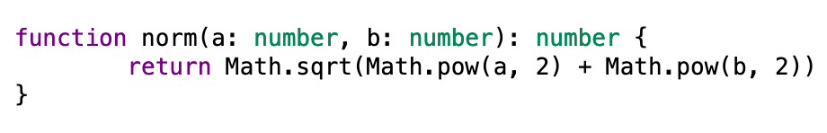

# react-lezer-highlighter

[](https://github.com/RichardLitt/standard-readme) [](https://opensource.org/licenses/MIT) [](https://www.npmjs.com/package/react-lezer-highlighter) 

A simple tiny syntax highlighter for React using [Lezer](https://lezer.codemirror.net/) parsers.

Background, motivation, and design of this library is covered in [this blog post](https://joelgustafson.com/posts/2022-05-31/syntax-highlighting-on-the-web).

## Table of contents

- [Install](#install)
- [Usage](#usage)
- [API](#api)
- [Contributing](#contributing)
- [License](#license)

## Install

```
npm i react-lezer-highlighter
```

## Usage

```tsx
import React from "react"
import { createRoot } from "react-dom/client"

import { Code, Parsers } from "react-lezer-highlighter"

import { parser as javascriptParser } from "@lezer/javascript"
import { parser as jsonParser } from "@lezer/json"

import "react-lezer-highlighter/styles/default.css"

const parsers = {
	js: javascriptParser,
	jsx: javascriptParser.configure({ dialects: "jsx" }),
	ts: javascriptParser.configure({ dialects: "ts" }),
	tsx: javascriptParser.configure({ dialects: "ts jsx" }),
	json: jsonParser,
	// ... import and add more languages as you see fit
}

const source = `function norm(a: number, b: number): number {
	return Math.sqrt(Math.pow(a, 2) + Math.pow(b, 2))
}`

const root = createRoot(document.getElementById("root"))
root.render(
	<Parsers.Provider value={parsers}>
		<Code language="ts" source={source} />
	</Parsers.Provider>
)
```



## API

```ts
import type React from "react"
import type { LRParser } from "@lezer/lr"

declare const Parsers: React.Context<Record<string, LRParser>>

declare interface CodeProps {
	language?: string
	source: string
}

declare const Code: React.FC<CodeProps>
```

## Contributing

react-lezer-highlighter is meant to be a proof-of-concept reference implementation - after all, it's only 30 lines of code. I'll publish new versions to track with Lezer, and would accept PRs for additional stylesheets in `styles/` if people want to create them, but it's unlikely that I want to add new features or change the basic interface.

## License

MIT (c) 2024 Joel Gustafson
